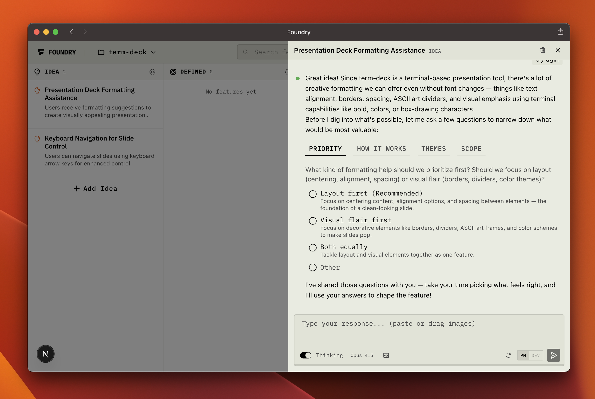

<p align="center">
  
</p>

---

## The bottleneck shifted. Your tools didn't.

Claude Code ships features end-to-end, but you're still spending hours figuring out **what** to build. Still copy-pasting user feedback into Notion. Still writing specs manually that go stale before the agent finishes reading them. Still context-switching between Linear, Slack, and the terminal to coordinate work that an AI could execute in ten minutes — if only someone told it what to do.

**The bottleneck in AI-assisted development is no longer code. It's coordination.**

Foundry is the orchestration layer between human intent and AI execution. Paste a rough idea. Get agent-executable specs in minutes. Ship it.

---

<p align="center">
  
  <br />
  <em>Idea → Defined → In Progress → Done. Drag-and-drop feature lifecycle with AI-powered spec generation.</em>
</p>

---

## What Foundry Does

### Idea Decomposition

Paste notes, voice transcripts, or half-baked thoughts. AI breaks them into discrete features.

### AI Spec Generation

Chat with a Foundry agent to refine any feature into a full mini-PRD: problem statement, solution, user stories, and acceptance criteria. Ready for handoff to any AI coding agent.

### Kanban Lifecycle

Drag features through **Idea → Defined → In Progress → Done**. Priority ordering, status management, and request tracking — a focused board built for AI-speed development.

### Git Integration

Review diffs, generate commit messages, and push — without leaving Foundry. AI-powered code review catches security issues, bugs, and architectural concerns.

### PM + Dev Modes

Toggle between non-technical and technical views of the same feature. PMs see outcomes and user stories. Developers see implementation details and acceptance criteria. Same source of truth.

---

## Why Foundry

You have an AI agent that can ship a feature in 10 minutes.
You spend 2 hours writing the spec for that 10-minute task.

| Today                                              | With Foundry                                         |
| -------------------------------------------------- | ---------------------------------------------------- |
| Ideas live in Notion, Slack, scattered notes       | Paste raw ideas, AI decomposes into features         |
| Specs written manually from scratch                | Chat-based spec refinement with full project context |
| Feedback trapped in emails and interviews          | Embeddable widget → auto-extraction → backlog        |
| Context-switching between Linear, Notion, terminal | One surface: board + specs + git + AI                |
| Specs written for humans to read                   | Specs structured for AI agents to execute            |

Tools built for human-speed development don't work at AI-speed.
Foundry does.

---

## Quick Start

```bash
git clone https://github.com/artinnok/foundry.git
cd foundry
```

Foundry uses [Vercel AI Gateway](https://vercel.com/ai-gateway) to route requests to multiple AI providers (Claude, Gemini) through a single API key. You can sign up for free at [vercel.com/ai-gateway](https://vercel.com/ai-gateway).

Create a `.env.local` file:

```bash
AI_GATEWAY_API_KEY="your-vercel-ai-gateway-key"
```

Then run `./start.command` — it pulls latest changes, installs dependencies, runs migrations, and starts the dev server:

```bash
./start.command
```

Open [localhost:5005](http://localhost:5005). Create a project. Paste an idea. Watch it decompose.

### Prerequisites

- [Bun](https://bun.sh) v1.0+
- A [Vercel AI Gateway](https://vercel.com/ai-gateway) API key (free tier available)
- That's it. SQLite is embedded. No Docker. No Postgres. No Redis.

---

## Tech Stack

| Layer         | Technology                                                 |
| ------------- | ---------------------------------------------------------- |
| **Framework** | Next.js 16, React 19, App Router                           |
| **Styling**   | Tailwind CSS v4, ShadCN UI (custom retro/industrial theme) |
| **Database**  | SQLite via bun:sqlite, Drizzle ORM                         |
| **AI**        | AI SDK v6, Claude Code Agent SDK, Google Gemini            |
| **Runtime**   | Bun                                                        |
| **Language**  | TypeScript                                                 |
| **Icons**     | Phosphor Icons                                             |

**Local-first by design.** No cloud database. No external services beyond AI. Your data stays on your machine.

---

## Roadmap

**Shipped**

- [x] Idea → feature decomposition with AI
- [x] AI spec generation via Claude Code agent
- [x] Kanban board with drag-and-drop
- [x] Feedback widget with auto-extraction
- [x] Git integration (diff, commit, push, code review)
- [x] PM and Dev mode toggle

**Next**

- [ ] Github integration (creating PRs, pulling branches)
- [ ] List view
- [ ] Better context management
- [ ] PRD export and sharing

---

## Contributing

Foundry is open source and contributions are welcome.

1. Fork the repository
2. Create a feature branch (`git checkout -b feat/your-feature`)
3. Make your changes
4. Run `bun run lint` to check for errors
5. Submit a pull request

---

## License

[MIT](LICENSE)

---

Built with conviction. Foundry was/is used to build Foundry.
